# 程序媛汇介绍
程序媛汇 Coding Girls Club (CGC)诞生于 2016 年 6 月 1 日，是一家为女性数字化赋能为己任的社会企业。CGC 通过编程科普、启蒙工作坊、职业培训等线上线下结合的形式，鼓励更多女性体验编程并进入 STEM 领域。至今，CGC 已在全国 10 个城市举办了超过 20 场编程城市活动，并联合全国 17 所高校举办“一日编程”活动，累计参与的学员近 4000 人，得到了来自中国日报、环球时报、CCTV 等媒体的报道关注。2018 年，CGC 入选由联合国开发计划署发起的“科技与慈善”项目案例集，2019 年成为共青团中央"全国青年社会组织「伙伴计划」"获奖项目。CGC 聚集着一群正直、善良且富有才华的小伙伴，致力建构互联互助的信息学习平台，为女性和女性自我提升数字化赋能，我们相信数字赋能女性，多元改变世界。
官网：http://codingirlsclub.com/about

# 学员手册
* [搭建网站](#搭建网站)
  * 网站效果预览
  * [注册 Github 账号](#注册-github-账号)
  * [使用博客模版来创建属于自己的 git 仓库](#使用博客模版来创建属于自己的-git-仓库)
  * [配置 GitHub Pages](#配置-github-pages)
* [自定义网站内容](#自定义网站内容)
  * [修改 baseurl](#修改-baseurl)
  * [修改网站的主题和标题](#修改网站的主题和标题)
  * [提交更改合并到 git 仓库的主分支](#提交更改合并到-git-仓库的主分支)
* [发布, 更改, 删除文章](#发布-更改-删除文章)
  * [发布新文章](#发布新文章)
  * [更改文章](#更改文章)
  * [删除文章](#删除文章)
* [小知识](#小知识)
  * [上传图片](#上传图片)
  * [什么是 Jekyll ?](#什么是-jekyll-)

:warning: _以下每一步的配图你可能会发现图片中仓库的名称和本仓库名称不符合, 请忽视, 它不会影响你博客的搭建喔_

# 搭建网站
## 网站效果预览

TBD

## 注册 Github 账号
请点击这里[注册 GitHub](https://github.com/join?ref_cta=Sign+up&ref_loc=header+logged+out&ref_page=%2F&source=header-home), 注册成功之后，登录 GitHub。  
如果你已经有 GitHub 账户，请跳过这一步！  

## 使用博客模版来创建属于自己的 git 仓库
### 1. 登录到 GitHub 之后，点击 [Girls-Coding-Day-Jekyll-blog-1](https://github.com/CodingGirlsClub/Girls-Coding-Day-Jekyll-blog-1) 进入仓库, 点击右上角的 `Use this template` 按钮。  
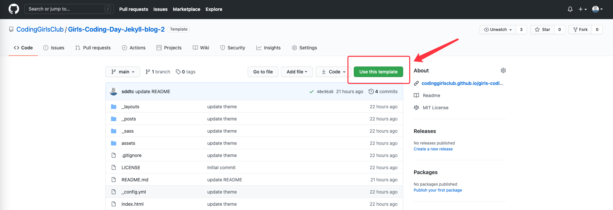

### 2. 填写仓库名称, 仓库简介, 选择仓库类型为 Public, 勾选 Include all branches. 点击 `Create repositorye from template` 按钮  


### 3. 仓库创建成功
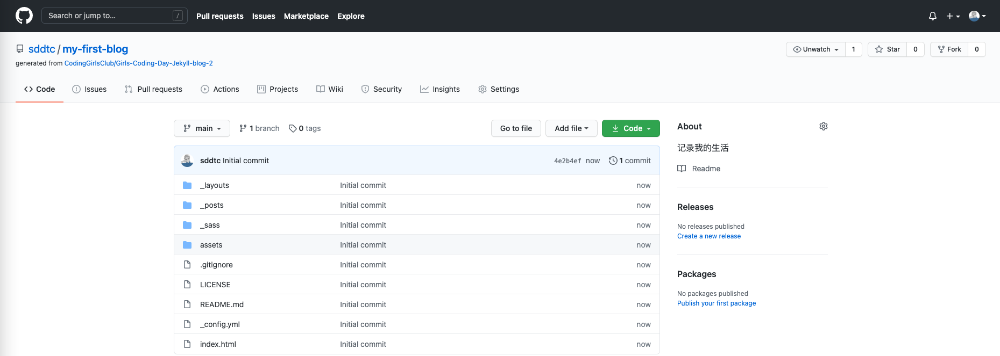

## 配置 GitHub Pages
### 1. 找到 `Settings` 选项, 点击 `Settings`


### 2. 将 `Settigns` 页面下拉, 找到 `GitHub Pages` 设置区域. 点击 `Source` 下面的下拉框，选择 `main` 分支之后，点击 `Save` 按钮:  


### 3. 点击 `Save` 按钮之后会出现相应的博客访问地址.  
:warning: _地址还不可访问, 因此打开页面会出现 404 (找不到该页面)_
  


# 自定义网站内容
### 1. 点击并打开 [`_config.yml`](_config.yml) 文件  

### 2. 点击 铅笔 按钮进入编辑模式  
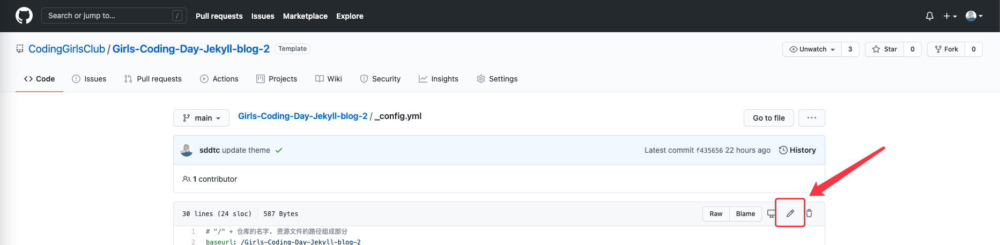

## 修改 baseurl
将默认 `_config.yml` 中:  

```
# "/" + 仓库的名字. 资源文件的路径组成部分
baseurl: "/Girls-Coding-Day-Jekyll-blog-1"
```

修改为自己的仓库名称, 例如你的仓库名称为 `my-first-blog`:  
:warning: _可以在 [使用博客模版来创建属于自己的-git-仓库](#2-填写仓库名称-仓库简介-选择仓库类型为-public-勾选-include-all-branches-点击-create-repositorye-from-template-按钮) 找到你的仓库名称_ 😉

```
# "/" + 仓库的名字. 资源文件的路径组成部分
baseurl: "/my-first-blog"
```

## 修改网站的主题和标题
修改 `_config.yml` 中 `title`, `subTitle`, `description`, `keywords`, `author` 的值, 将其替换为你需要的值:  

```
# 网站的主标题
title: "Girls Coding Day"
# 网站副标题
subTitle: "架起女性与编程的桥梁"
description: "关注我们公众号/微博：codingirlsclub"
keywords: "女性, 编程, 教育, 公益"
author: "文洋"
```

例如:  

```
# 网站的主标题
title: "xx 的小世界"
# 网站副标题
subTitle: "记录我的生活，学习和工作感悟 🥳"
description: ""
keywords: "编程, 动漫"
author: "阿白"
```

> **注意事项 ⚠️**
> 1. `_config.yml` 文件中使用的都是英文标点, 请不要使用中文标点;
> 2. 冒号后面有一个空格;
> 请严格遵守上述要求, 否则网站配置会不成功, 导致无法访问;

## 提交更改合并到 git 仓库的主分支
### 1. 下拉网页看到提交信息填写部分, 填写标题和提交的简单介绍信息


### 2. 填写完整相应的信息, 点击 `Commit changes` 按钮  
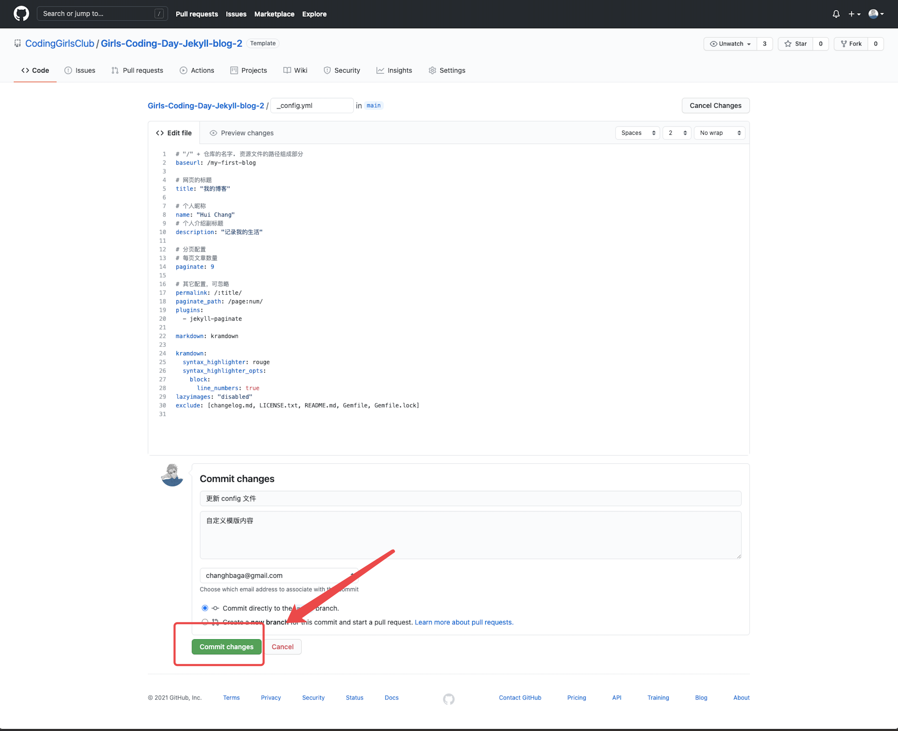

# 🎉 恭喜你 🎉 :smirk: 到这里, 你就可以通过网址来访问自己的网站啦!!!  
🥳🥳🥳 网站地址可以在这里找到 [点击-save-按钮之后会出现相应的博客访问地址](#3-点击-save-按钮之后会出现相应的博客访问地址)  

:warning: _可能由于 GitHub Pages 有延迟和缓存的问题，你需要等一会儿访问, 3~5 分钟不等_

# 发布, 更改, 删除文章
## 发布新文章
### 1. 点击 [`_post`](_posts) 文件夹进入文章列表页面  

### 2. 点击 `Add file` 按钮, 选择 `Create new file`  

### 3. 添加文章名称, 添加文章内容, 编写完成之后点击 `Commit file` 按钮
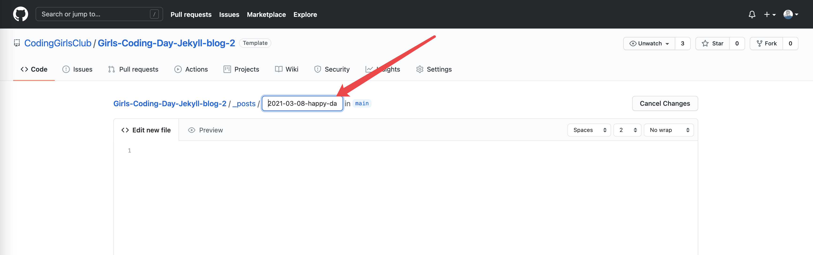

> **文章标题 注意事项 ⚠️**  
> 在编辑页面输入文章名称，名称符合如下格式:  
> - 文件名必须以日期开头，如`2021-03-01`
> - 文件名必须使用英文命名，多个单词之间用中划线`-`连接
> - 日期与英文之间用`-`中划线连接
> - 文件名必须以`.md`结尾

例如: `2021-03-01-hello-world.md`  

> **文章内容 注意事项 ⚠️**  
> 在编辑页面输入文章内容，需要符合如下格式:  
> - 文章必须以
```yml
---
title: "Girls Coding Day"
subtitle: "架起女性与编程的桥梁"
author: "文洋"
avatar: "assets/images/authors/cabbage.png"
image: "assets/images/girl.jpg"
date: 2020-03-08 12:12:12
---
```
> 开头

其中:  
1. `title, subtitle, author` 的值可以替换为其它内容, 标题的值必须用双引号 `"` 包住  
2. `avatar, image` 的内容来自于 [assets/images](assets/images) 文件夹下, 你可以上传本地. 详细方法见 [上传图片](#上传图片)  
3. `date` 的值是以 `-` 分隔的日期 


添加文章成功之后, 别忘了访问网站查看效果 :raised_hands:  
🥳🥳🥳 网站地址可以在这里找到 [点击-save-按钮之后会出现相应的博客访问地址](#3-点击-save-按钮之后会出现相应的博客访问地址)  

:warning: _可能由于 GitHub Pages 有延迟和缓存的问题，你需要等一会儿访问, 3~5 分钟不等_

## 更改文章
### 点击 铅笔 进行文章的更新, 填写完成之后点击 `Commit changes` 按钮  


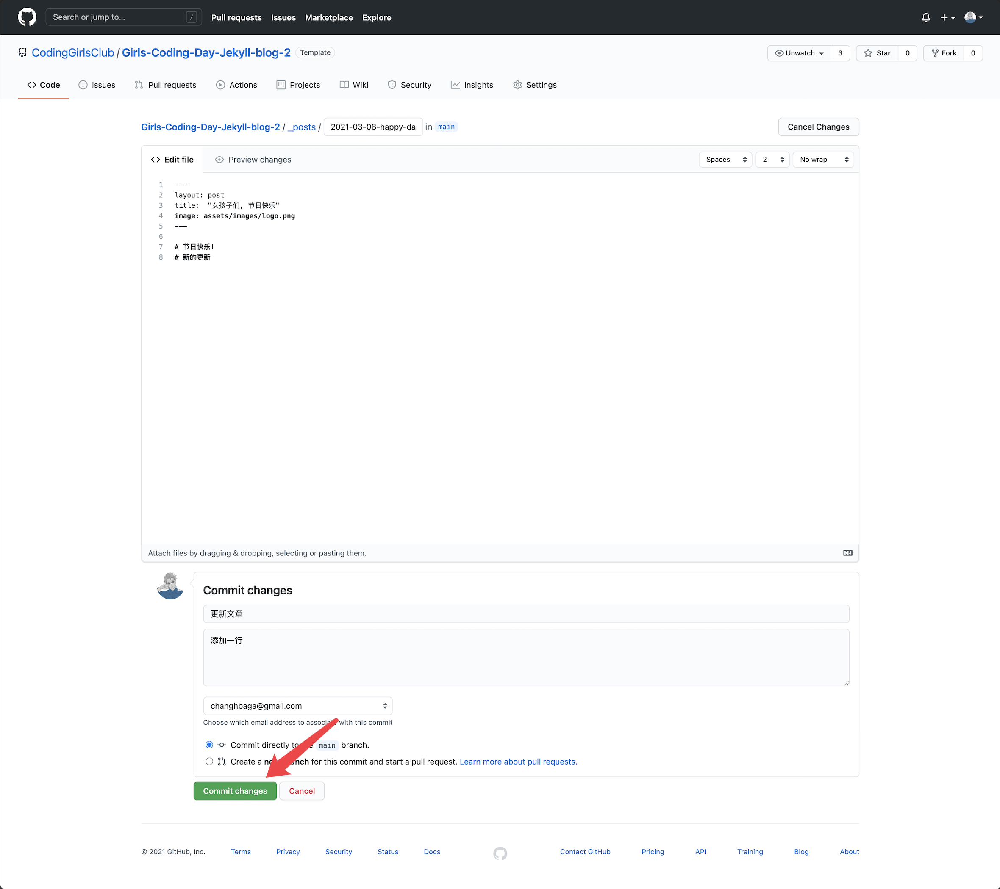

更改文章成功之后, 别忘了访问网站查看效果 :raised_hands:  
🥳🥳🥳 网站地址可以在这里找到 [点击-save-按钮之后会出现相应的博客访问地址](#3-点击-save-按钮之后会出现相应的博客访问地址)  

:warning: _可能由于 GitHub Pages 有延迟和缓存的问题，你需要等一会儿访问, 3~5 分钟不等_  

## 删除文章  
### 点击 垃圾箱 进行文章的删除  
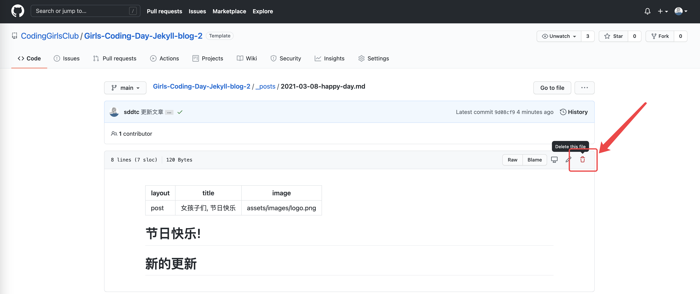

### 填写相应信息, 点击 `Commit changes` 按钮  
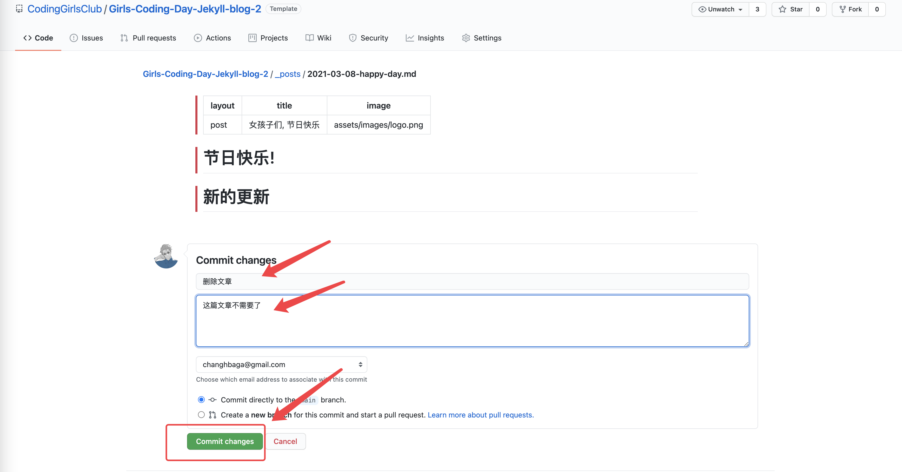

删除文章成功之后, 别忘了访问网站查看效果 :raised_hands:  
🥳🥳🥳 网站地址可以在这里找到 [点击-save-按钮之后会出现相应的博客访问地址](#3-点击-save-按钮之后会出现相应的博客访问地址)
  
:warning: _可能由于 GitHub Pages 有延迟和缓存的问题，你需要等一会儿访问, 3~5 分钟不等_

# 小知识
## 上传图片  
### 1. 打开图片目录, 进入到 [`assets/images`](assets/images) 文件夹下

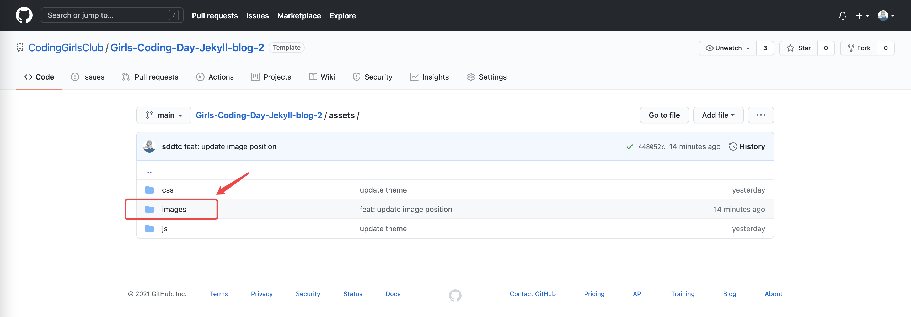  

### 2. 点击 `Add file` 按钮, 选择 `Upload files` 按钮  
  

### 3. 选择你电脑本机需要上传的图片  
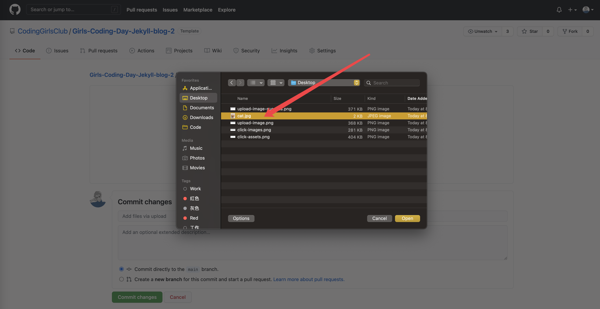  

:warning: _图片需要提前下载到本地, 图片名称**不要**包含空格_  

### 4. 填写提交信息, 点击 `Commit changes` 按钮  
  

### 5. 等待图片上传  


### 6. 查看图片结果  
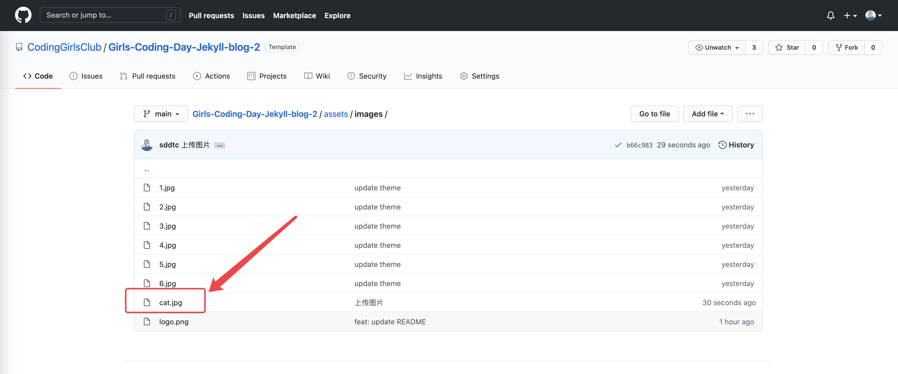

## 什么是 Jekyll ? 
Jekyll 是一个简单的博客形态的静态站点生成器。它有一个模版目录，其中包含原始文本格式的文档，通过一个转换器（如 Markdown）和我们的 Liquid 渲染器转化成一个完整的可发布的静态网站，你可以发布在任何你喜爱的服务器上。Jekyll 也可以运行在 `GitHub Page` 上，也就是说，你可以使用 GitHub 的服务来搭建你的项目页面、博客或者网站，而且是完全免费的。  
我们的网站就是基于 Jekyll 并运行在 `GitHub Page` :) 

到这里，相信你已经有了自己的网站，同时发表了自己的博客哦！
